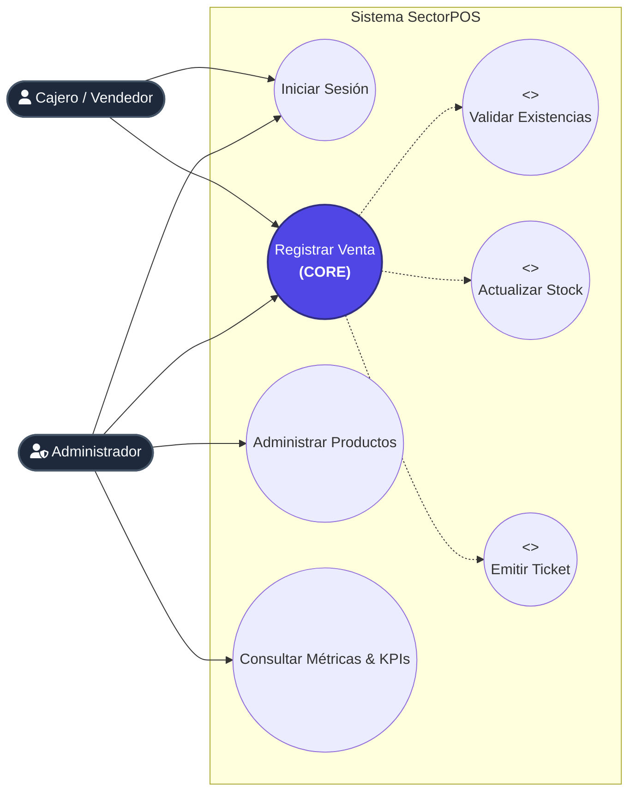
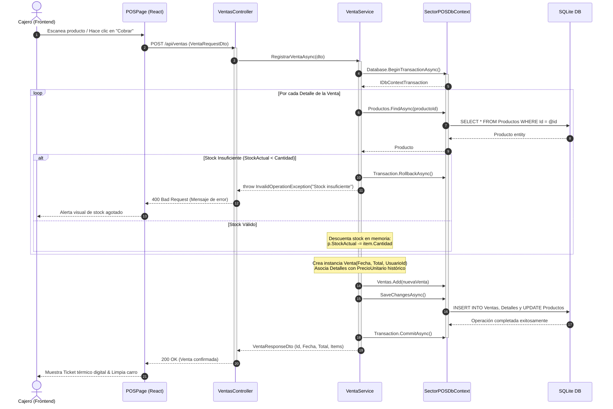
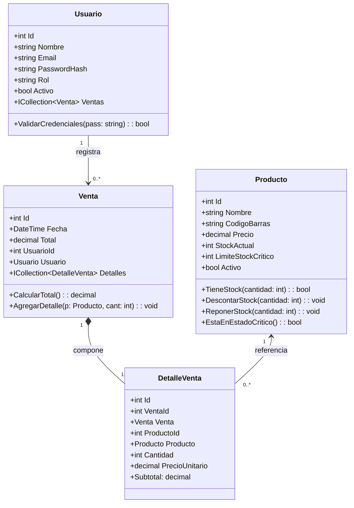
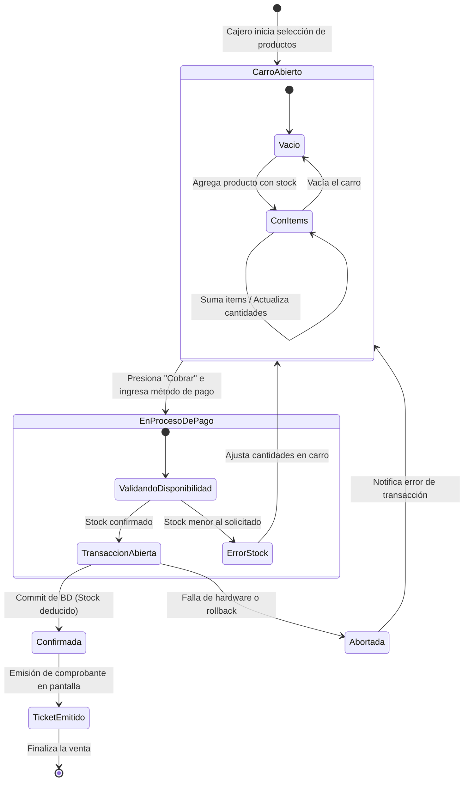
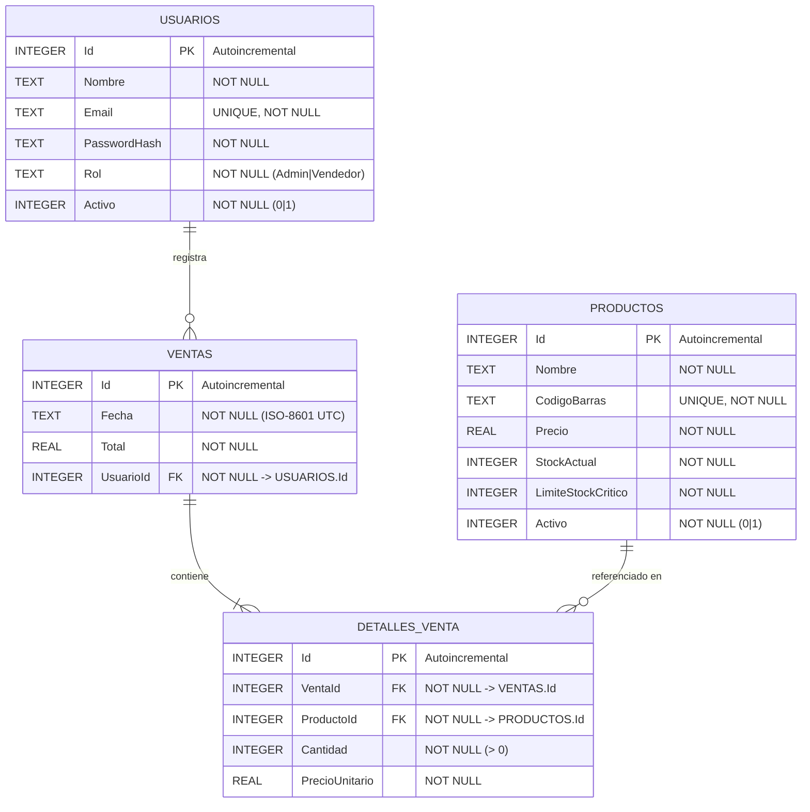
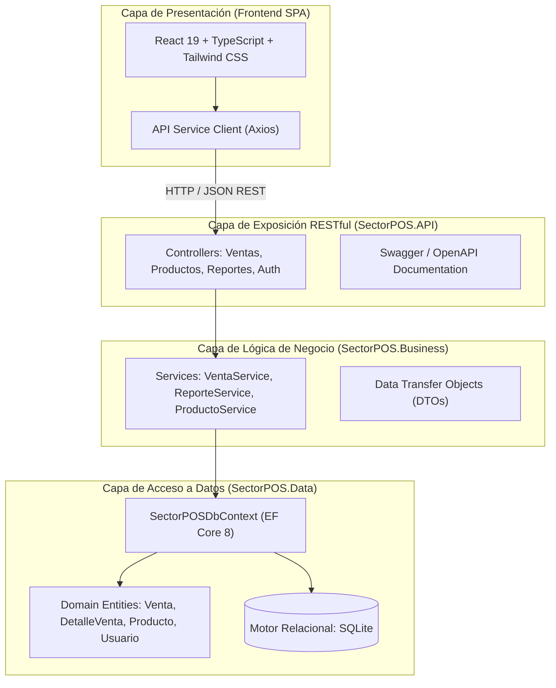
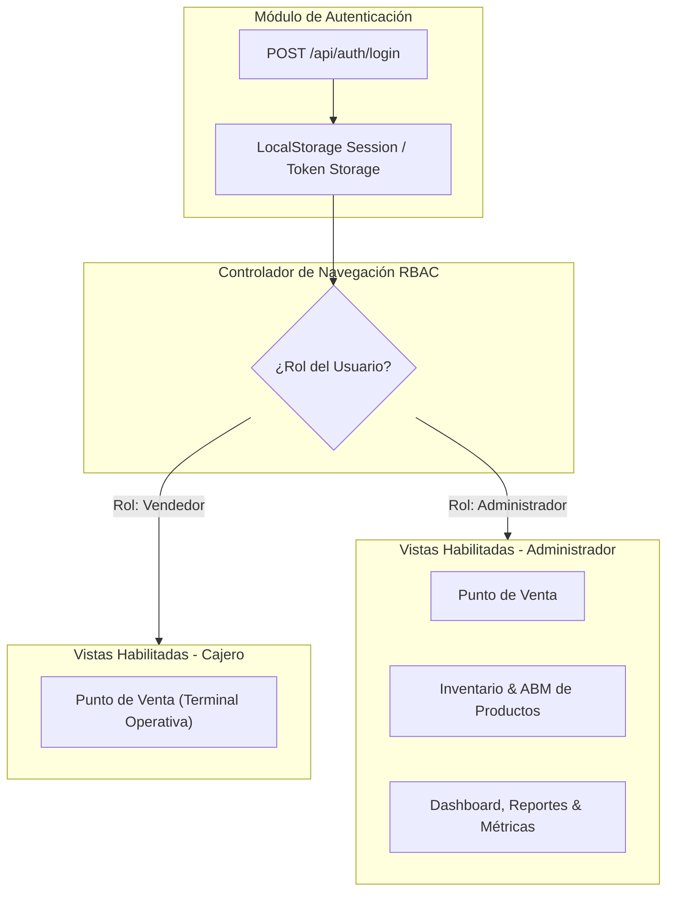

# UNIVERSIDAD TECNOLÓGICA NACIONAL
## FACULTAD REGIONAL SAN NICOLÁS
### TECNICATURA UNIVERSITARIA EN PROGRAMACIÓN (TUP)

---

# INFORME TÉCNICO DE PROYECTO FINAL INTEGRADOR
# **SectorPOS - Sistema de Punto de Venta & Gestión Comercial Cloud**

---

## ÍNDICE GENERAL

1. [Inicio del Proyecto](#1-inicio-del-proyecto)
2. [Nombre del Proyecto](#2-nombre-del-proyecto)
3. [Descripción del Proyecto](#3-descripción-del-proyecto)
4. [Objetivos del Proyecto](#4-objetivos-del-proyecto)
   - 4.1 Objetivo General
   - 4.2 Objetivos Específicos
5. [Definición de Requerimientos](#5-definición-de-requerimientos)
   - 5.1 Requerimientos Funcionales (RF)
   - 5.2 Requerimientos No Funcionales (RNF)
6. [Alcance del Proyecto](#6-alcance-del-proyecto)
   - 6.1 Límites del Sistema (In Scope)
   - 6.2 Fuera del Alcance (Out of Scope)
7. [Registro de Interesados (Stakeholders)](#7-registro-de-interesados)
8. [Cronograma de Hitos del Proyecto](#8-cronograma-de-hitos-del-proyecto)
9. [Criterios de Aceptación del Producto](#9-criterios-de-aceptación-del-producto)
10. [Supuestos del Proyecto](#10-supuestos-del-proyecto)
11. [Restricciones del Proyecto](#11-restricciones-del-proyecto)
12. [Iteraciones del Producto - Requerimiento Core: "Registrar Venta"](#12-iteraciones-del-producto---requerimiento-core)
    - 12.1 Especificación Formal del Caso de Uso
    - 12.2 Diagrama de Casos de Uso (UML)
    - 12.3 Diagrama de Secuencia (UML)
    - 12.4 Diagrama de Clases del Dominio (POO)
    - 12.5 Diagrama de Transición de Estados
    - 12.6 Diagrama Entidad-Relación (DER Físico)
13. [Reportes, Indicadores y Estadísticas](#13-reportes-indicadores-y-estadísticas)
14. [Manual de Usuario e Instructivo Operativo](#14-manual-de-usuario-e-instructivo-operativo)
15. [Anexos Técnicos](#15-anexos-técnicos)
    - [Anexo 15.1: Arquitectura del Software](#anexo-151-arquitectura-del-software)
    - [Anexo 15.2: Seguridad y Control de Acceso (RBAC)](#anexo-152-seguridad-y-control-de-acceso-rbac)

---

## 1. INICIO DEL PROYECTO

El presente proyecto nace como respuesta a la necesidad operativa detectada en el sector de micro, pequeñas y medianas empresas (MiPyMEs) y comercios minoristas del rubro gastronómico, tiendas de conveniencia y minimercados. Históricamente, estos establecimientos enfrentan serias dificultades derivadas del uso de sistemas de registro rudimentarios (planillas de cálculo manuales o libros contables en papel) o de softwares POS de escritorio tradicionales altamente obsoletos, costosos de licenciar y con arquitecturas cerradas incapaces de interoperar en la nube.

Dichas limitaciones generan mermas económicas por desfasajes de inventario (quiebre o sobrestock), lentitud en las colas de cobro en horas pico, imposibilidad de auditar las ventas por operador y ausencia de métricas en tiempo real para la toma estratégica de decisiones. Ante este escenario, **SectorPOS** se gesta con la finalidad de proveer una solución web moderna, de alto rendimiento, ágil en la línea de cajas y con un estricto control transaccional sobre las existencias de mercadería.

---

## 2. NOMBRE DEL PROYECTO

- **Denominación Formal:** **SectorPOS - Cloud Point of Sale & Retail Management Engine**
- **Nombre Abreviado:** **SectorPOS**
- **Tipología de Aplicación:** Web Application (Single Page Application desacoplada con backend RESTful API).

---

## 3. DESCRIPCIÓN DEL PROYECTO

**SectorPOS** es una plataforma integral de gestión comercial y punto de venta diseñada bajo los estándares de la arquitectura limpia y el paradigma de programación orientada a objetos (POO). Su función primordial es optimizar, agilizar y asegurar el ciclo completo de facturación e inventario de un comercio en tiempo real.

La solución articula:
1. Un **módulo operativo de cobro rápido (POS)** optimizado para teclado y lector óptico de código de barras, con cálculo automático de vuelto, comprobantes térmicos en pantalla y verificación atómica de existencias.
2. Un **módulo de administración de inventarios (ABM)** con altas, bajas lógicas, parametrización de precios, definición de umbrales de stock crítico y reabastecimiento rápido de mercadería.
3. Un **centro de analítica y reportes gerenciales (Dashboard)** que procesa indicadores clave de rendimiento (KPIs), tendencias diarias de recaudación y ranking de productos de mayor rotación.
4. Un **subsistema de seguridad basado en roles (RBAC)** que regula los privilegios entre el personal de línea (Cajeros) y el nivel ejecutivo (Administradores).

---

## 4. OBJETIVOS DEL PROYECTO

### 4.1 Objetivo General
Diseñar, desarrollar e implementar una aplicación web transaccional de Punto de Venta (POS) y administración comercial que reduzca los tiempos de atención en mostrador a menos de 10 segundos por transacción, garantice la consistencia atómica del inventario y provea información gerencial en tiempo real a través de una interfaz moderna y responsiva.

### 4.2 Objetivos Específicos (Criterios SMART)
1. **Atención Rápida en Caja:** Implementar un flujo de venta ágil que permita buscar productos por código de barras o texto predictivo en un lapso no mayor a 100 milisegundos.
2. **Consistencia Transaccional:** Garantizar el cumplimiento estricto de las propiedades **ACID** (Atomicidad, Consistencia, Aislamiento y Durabilidad) en la registración de cada venta, impidiendo ventas de mercadería sin stock suficiente bajo situaciones de concurrencia.
3. **Control Automatizado de Stock:** Disparar alertas visuales inmediatas cuando las unidades de un artículo desciendan por debajo de su umbral de stock crítico configurado.
4. **Visibilidad Ejecutiva:** Generar de manera automatizada reportes de facturación diaria, ticket promedio y los 5 productos más vendidos mediante un dashboard visual sin requerir procesos de cierre de caja por lotes ("batch").
5. **Control de Acceso Riguroso:** Implementar autenticación segura y segregación de funciones (RBAC), impidiendo que el perfil "Cajero" pueda acceder a costos, modificaciones de precios o balances de ganancias.

---

## 5. DEFINICIÓN DE REQUERIMIENTOS

### 5.1 Requerimientos Funcionales (RF)

| Código | Módulo | Descripción Detallada | Prioridad |
| :--- | :--- | :--- | :--- |
| **RF-01** | Seguridad | El sistema debe permitir el inicio de sesión mediante correo electrónico y contraseña. | Alta (Core) |
| **RF-02** | Seguridad | El sistema debe implementar control de acceso basado en roles (Cajero / Administrador). | Alta (Core) |
| **RF-03** | Seguridad | El sistema debe permitir el cierre seguro de sesión (Logout), invalidando el estado local. | Alta |
| **RF-04** | POS | El sistema debe permitir la lectura de productos mediante escáner de código de barras o búsqueda por texto. | Alta (Core) |
| **RF-05** | POS | El sistema debe verificar en tiempo real que la cantidad solicitada no supere el stock disponible. | Alta (Core) |
| **RF-06** | POS | El sistema debe calcular subtotal, descuentos, total acumulado y cálculo de vuelto en efectivo. | Alta (Core) |
| **RF-07** | POS | El sistema debe registrar la venta atómicamente, emitiendo el comprobante y descontando el stock. | Alta (Core) |
| **RF-08** | POS | El sistema debe permitir redimensionar la visualización del panel de ticket para ergonomía del cajero. | Media |
| **RF-09** | Inventario | El sistema debe permitir dar de alta productos con nombre, código, precio, stock inicial y stock crítico. | Alta |
| **RF-10** | Inventario | El sistema debe validar que el código de barras asignado sea único en el catálogo. | Alta |
| **RF-11** | Inventario | El sistema debe permitir modificar precios de venta y umbrales de stock crítico. | Alta |
| **RF-12** | Inventario | El sistema debe permitir la reposición ágil de stock mediante cantidades directas o presets (+5, +10, etc.). | Alta |
| **RF-13** | Inventario | El sistema debe implementar baja lógica (activar/desactivar producto sin eliminar histórico de ventas). | Alta |
| **RF-14** | Reportes | El sistema debe exhibir en tiempo real: Facturación del día, cantidad de tickets y ticket promedio. | Alta |
| **RF-15** | Reportes | El sistema debe calcular el Top 5 de productos más vendidos y gráfico de recaudación de los últimos 7 días. | Media |
| **RF-16** | Reportes | El sistema debe listar los artículos que se encuentren en estado de quiebre o stock crítico. | Alta |

### 5.2 Requerimientos No Funcionales (RNF)

| Código | Atributo | Especificación Técnica |
| :--- | :--- | :--- |
| **RNF-01** | **Rendimiento** | El tiempo de respuesta de los endpoints de consulta de catálogo debe ser inferior a 200 ms con 1.000 artículos en base. |
| **RNF-02** | **Concurrencia / ACID** | Las transacciones de venta deben ejecutarse bajo nivel de aislamiento transaccional que impida la condición de carrera (*race conditions*) sobre el inventario. |
| **RNF-03** | **Disponibilidad** | Arquitectura desacoplada en backend y frontend lista para despliegue en entornos Cloud (Azure / AWS / Render / Vercel). |
| **RNF-04** | **Usabilidad / Ergonomía** | Interfaz visual en modo oscuro ("Dark Fintech") diseñada con alto contraste, reduciendo la fatiga ocular del operario en jornadas continuas. |
| **RNF-05** | **Portabilidad Web** | Compatible con los navegadores modernos del mercado (Google Chrome, Microsoft Edge, Mozilla Firefox, Safari) bajo diseño responsive. |
| **RNF-06** | **Integridad Referencial** | Utilización de Object-Relational Mapping (Entity Framework Core 8) con llaves primarias, foráneas y restricciones de unicidad. |
| **RNF-07** | **Seguridad** | Hashing de credenciales y segregación visual y lógica de vistas mediante navegación condicionada. |
| **RNF-08** | **Mantenibilidad** | Código estructurado en arquitectura en capas N-Tier respetando los principios SOLID y la separación clara de responsabilidades. |

---

## 6. ALCANCE DEL PROYECTO

### 6.1 Límites del Sistema (In Scope)
- Catálogo de productos con soporte para códigos de barra alfanuméricos EAN-13 / CODE-128.
- Terminal interactiva de cobranza en mostrador con carro de compras dinámico.
- Verificación, validación y deducción atómica de existencias.
- Emisión de ticket térmico digital con detalle de ítems, forma de pago y vuelto.
- Módulo de ABM completo de mercaderías con filtros por estado de stock.
- Centro de analítica con cálculo de métricas financieras e inventario crítico.
- Subsistema de login con diferenciación de perfiles (Cajero y Administrador).

### 6.2 Fuera del Alcance (Out of Scope)
- Integración fiscal directa con webservices de AFIP/ARCA (Facturación electrónica CAE/QR) en esta iteración inicial.
- Pasarelas de cobro físico por terminales POSNET / tarjeta de crédito (se gestiona la registración del medio de pago en efectivo/débito).
- Módulo de compras a proveedores con cuentas corrientes a plazo.

---

## 7. REGISTRO DE INTERESADOS (STAKEHOLDERS)

| Interesado | Rol en el Proyecto | Expectativas Principales | Nivel de Interés | Nivel de Poder |
| :--- | :--- | :--- | :---: | :---: |
| **Dueño / Gerente de Comercio** | Patrocinador del Negocio | Controlar la caja, evitar fugas de stock y visualizar métricas de rentabilidad en tiempo real. | **Alto** | **Alto** |
| **Cajero / Operario de Mostrador** | Usuario Final Operativo | Cobrar con rapidez, contar con interfaz ágil sin bloqueos y cálculo claro del vuelto al cliente. | **Alto** | **Bajo** |
| **Encargado de Depósito / Inventario** | Usuario Administrativo | Reponer mercadería con facilidad, recibir alertas tempranas de stock crítico antes de que se agote. | **Alto** | **Medio** |
| **Prof. Ing. Pablo Audoglio** | Cátedra Tutoría (Evaluador) | Cumplimiento estricto del Proceso Unificado, POO, buenas prácticas arquitectónicas y completitud del informe. | **Alto** | **Alto** |
| **Equipo de Desarrollo (TUP)** | Desarrollador de Software | Construir una solución robusta, escalable, libre de deuda técnica y con código testeable. | **Alto** | **Alto** |

---

## 8. CRONOGRAMA DE HITOS DEL PROYECTO

El proyecto se estructuró siguiendo el marco ágil iterativo (Scrum con fases del Proceso Unificado):

```mermaid
gantt
    title Cronograma de Hitos - SectorPOS
    dateFormat  YYYY-MM-DD
    section Fase de Inicio
    Relevamiento & Alcance       :done,    des1, 2024-08-01, 2024-08-10
    Definición de Requerimientos :done,    des2, 2024-08-11, 2024-08-20
    section Fase de Elaboración
    Diseño de Arquitectura N-Capas:done,   des3, 2024-08-21, 2024-08-31
    Modelado de Dominio & DER    :done,    des4, 2024-09-01, 2024-09-08
    section Fase de Construcción
    Iteración Core: Venta & ACID :done,    des5, 2024-09-09, 2024-09-22
    Módulo ABM e Inventario      :done,    des6, 2024-09-23, 2024-10-05
    Dashboard & KPIs Analíticos  :done,    des7, 2024-10-06, 2024-10-18
    Seguridad & Control RBAC     :done,    des8, 2024-10-19, 2024-10-28
    section Fase de Transición
    Testing de Integración & UAT :done,    des9, 2024-10-29, 2024-11-05
    Documentación Final UTN      :active,  des10, 2024-11-06, 2024-11-15
```

---

## 9. CRITERIOS DE ACEPTACIÓN DEL PRODUCTO

1. **Prueba de Transaccionalidad Exitosa:** Al procesar un pedido de 3 unidades de un producto con stock de 10, el sistema debe registrar el comprobante de venta, guardar los detalles con el precio histórico del momento y decrementar el stock exactamente a 7 unidades.
2. **Prueba de Bloqueo por Sobreventa:** Si un usuario intenta cobrar una cantidad superior a la existencia física en base de datos, el backend debe rechazar la operación mediante HTTP 400 Bad Request, impidiendo que el inventario asuma valores negativos.
3. **Prueba de Quiebre de Stock:** Al registrar una venta que deje las existencias por debajo del `limiteStockCritico`, el sistema debe marcar de inmediato al producto con advertencia amarilla/roja tanto en el POS como en el Dashboard y la tabla de Inventario.
4. **Prueba de Segregación RBAC:** Al iniciar sesión con credenciales de Cajero (`caja@sectorpos.com`), las opciones de Inventario y Dashboard no deben ser visibles ni accesibles. Al iniciar sesión con Administrador (`admin@sectorpos.com`), todos los módulos deben estar disponibles.

---

## 10. SUPUESTOS DEL PROYECTO

1. El comercio cuenta con conectividad de red local o acceso a Internet para la comunicación entre la terminal cliente (Frontend React) y el servidor de API (.NET 8).
2. Los lectores de código de barras operan en modo emulación de teclado (HID Keyboard Emulation), transmitiendo la cadena alfanumérica seguida de la tecla `Enter`.
3. El personal que opera la caja dispone de capacitación elemental en navegación web.
4. La moneda de curso legal configurada para la operatoria es el Peso Argentino (ARS), con soporte para dos decimales.

---

## 11. RESTRICCIONES DEL PROYECTO

1. **Lenguaje y Plataforma:** El backend debe estar desarrollado en lenguaje C# sobre el framework Microsoft .NET 8, respetando el paradigma de Programación Orientada a Objetos.
2. **Motor de Persistencia:** Empleo de SQLite como motor embebido relacional de alta velocidad para entornos locales o demostrativos, interactuando exclusivamente a través de Entity Framework Core 8.
3. **Frontend SPA:** La interfaz de usuario debe estar construida en React 19 con TypeScript y Tailwind CSS, prescindiendo de recargas completas de página (Zero-Refresh Architecture).
4. **Plazo de Entrega Académico:** Ajustado estrictamente a los plazos fijados por el calendario de la cátedra de Tutoría de la UTN FRSN.

---

## 12. ITERACIONES DEL PRODUCTO - REQUERIMIENTO CORE: "REGISTRAR VENTA"

El núcleo de la solución radica en la iteración sobre el requerimiento crítico del negocio: **Registrar Venta con Deducción de Stock Atómica**.

### 12.1 Especificación Formal del Caso de Uso

- **Identificador:** CU-01
- **Nombre:** Registrar Venta en Mostrador
- **Actor Principal:** Cajero / Vendedor
- **Actores Secundarios:** Sistema de Inventario (Servicio interno), Motor de Persistencia (SQLite/EF Core)
- **Precondiciones:**
  1. El Cajero debe haber iniciado sesión previamente (sesión autenticada).
  2. Debe existir al menos un producto activo con stock mayor a cero en el catálogo.

#### Flujo Principal (Camino Básico):
1. El Cajero inicia una nueva transacción de venta.
2. El Cajero ingresa un producto leyendo su código de barras con el lector óptico o seleccionándolo desde el panel visual.
3. El sistema valida que el producto exista, se encuentre activo y posea existencias disponibles (`StockActual >= Cantidad`).
4. El sistema agrega el producto al carro de ventas e incrementa el total acumulado.
5. El Cajero repite los pasos 2 a 4 para todos los artículos del cliente.
6. El Cajero presiona el botón "Proceder al Cobro".
7. El sistema solicita el método de pago (Efectivo / Transferencia / Débito) y el monto recibido.
8. El sistema calcula en tiempo real el vuelto correspondiente.
9. El Cajero confirma el cobro.
10. El backend inicia una transacción de base de datos (`BeginTransactionAsync`).
11. El sistema descuenta el stock de cada artículo involucrado.
12. El sistema crea la cabecera de la `Venta` con fecha/hora UTC y el `UsuarioId` del cajero.
13. El sistema guarda cada `DetalleVenta` con el precio unitario histórico congelado.
14. El backend confirma la transacción (`CommitAsync`).
15. El sistema emite el comprobante de venta digital en pantalla y limpia el carro de compras para el siguiente cliente.

#### Flujos Alternativos y Excepciones:
- **3a. Stock Insuficiente:** Si la cantidad demandada supera el stock disponible en base de datos, el sistema aborta la adición, notifica un mensaje de error ("Stock insuficiente") y no permite avanzar al cobro.
- **7a. Cancelación del Carro:** El cajero puede limpiar el carro o eliminar productos individuales en cualquier momento previo a la confirmación, sin impacto en la base de datos.
- **10a. Error de Concurrencia o Base de Datos:** Si ocurre un fallo durante la escritura, el backend ejecuta `RollbackAsync()`, las existencias no se modifican y se retorna un código de error HTTP 500 informando al cajero.

---

### 12.2 Diagrama de Casos de Uso (UML)



---

### 12.3 Diagrama de Secuencia (UML)

Secuencia transaccional completa de la operación de venta entre Frontend, Controlador REST, Capa de Negocio, Entidades y Base de Datos:



---

### 12.4 Diagrama de Clases del Dominio (POO)

Estructura de clases de las entidades del modelo de dominio desarrolladas en C#:



---

### 12.5 Diagrama de Transición de Estados

Ciclo de vida de los datos de inventario y estado del comprobante de venta:



---

### 12.6 Diagrama Entidad-Relación (DER Físico)

Modelo relacional normalizado persistido en SQLite mediante Entity Framework Core:



---

## 13. REPORTES, INDICADORES Y ESTADÍSTICAS

El módulo de reportes y analítica de SectorPOS se alimenta del servicio `ReporteService` y del endpoint `GET /api/reportes/dashboard`, consolidando en tiempo real las siguientes métricas de negocio:

### 1. Métricas Financieras Principales (KPI Cards)
- **Ventas del Día:** Sumatoria monetaria de todas las ventas concretadas en la jornada actual. Permite conocer la recaudación bruta en mostrador.
- **Cantidad de Transacciones Hoy:** Contador de comprobantes emitidos. Mide el volumen de operaciones del día.
- **Ticket Promedio:** Relación `Total Recaudado / Cantidad de Ventas`. Indicador clave para evaluar el valor medio de consumo por cliente.
- **Recaudación Histórica Acumulada:** Volumen total transaccionado por el comercio desde la puesta en marcha del sistema.

### 2. Tendencia Semanal de Facturación (Gráfico de Barras SVG/CSS)
Desglosa los ingresos monetarios de los últimos 7 días con identificación del día de la semana y cálculo de porcentaje de altura relativa respecto al día pico. Permite identificar patrones de afluencia semanal (días de mayor o menor venta).

### 3. Ranking de Productos Más Vendidos (Top 5 Rotación)
Lista ordenada de los 5 artículos con mayor salida de mercadería, indicando:
- Unidades totales comercializadas.
- Monto acumulado generado por dicho producto.
- Barra de progreso porcentual respecto al ítem líder.

### 4. Monitor de Alertas de Stock Crítico y Quiebre
Identifica de forma proactiva aquellos productos cuyas existencias físicas son menores o iguales al `limiteStockCritico`. Muestra alertas amarillas (Stock bajo) o rojas (Quiebre / Stock en cero) con enlace directo para reponer mercadería.

---

## 14. MANUAL DE USUARIO E INSTRUCTIVO OPERATIVO

### Paso 1: Autenticación y Acceso al Sistema
1. Abra el navegador e ingrese a la dirección web de SectorPOS (`http://localhost:5173`).
2. En la pantalla de inicio de sesión:
   - Para perfil de mostrador: Ingrese `caja@sectorpos.com` / `admin123` (o haga clic en el botón rápido **Cajero**).
   - Para perfil gerencial: Ingrese `admin@sectorpos.com` / `admin123` (o haga clic en el botón rápido **Administrador**).
3. Presione **"Iniciar Sesión"**. El sistema verificará sus credenciales y accederá al entorno de trabajo correspondiente.

### Paso 2: Operación del Punto de Venta (Cajero)
1. **Buscar y Agregar Productos:**
   - Puede escribir el nombre o código de barras en la barra de búsqueda superior.
   - O bien, hacer clic directo sobre la tarjeta del producto en la grilla visual.
   - Si utiliza lector óptico, simplemente apunte al código de barras del producto; se agregará automáticamente al carro.
2. **Gestionar Cantidades:**
   - En el panel derecho (Ticket en curso), use los botones `+` y `-` para ajustar cantidades.
   - El sistema impedirá superar el stock real del producto.
3. **Cobrar la Venta:**
   - Presione el botón verde **"Proceder al Cobro"**.
   - Seleccione el medio de pago (Efectivo / Débito / QR).
   - Si abona en efectivo, ingrese el monto recibido. El sistema calculará y mostrará el vuelto exacto a entregar.
   - Presione **"Confirmar Cobro"**.
4. **Comprobante:**
   - Aparecerá un modal en pantalla con el ticket térmico formal emitido, listo para imprimir o cerrar.

### Paso 3: Gestión de Inventario & ABM (Solo Administrador)
1. Seleccione la pestaña superior **"Inventario & ABM"**.
2. **Nuevo Producto:** Presione **"+ Nuevo Producto"**, complete nombre, código de barras, precio unitario, stock inicial y umbral de alerta crítica. Guarde los cambios.
3. **Modificar Precios:** En la fila del producto, haga clic en el botón **"Editar"** (ícono de lápiz), ajuste el precio de venta y guarde.
4. **Reponer Mercadería:** Haga clic en **"Reponer"** en cualquier artículo. Utilice los botones de carga rápida (+5, +10, +25, +50, +100 unidades) para sumar existencias de manera inmediata.
5. **Baja Lógica:** Use el botón de alternancia en la columna de acciones para deshabilitar un producto temporalmente sin borrar su histórico de ventas.

### Paso 4: Consulta de Reportes y KPIs (Solo Administrador)
1. Seleccione la pestaña superior **"Reportes & Métricas"**.
2. Revise los paneles superiores de facturación y ticket medio.
3. Observe el gráfico de los últimos 7 días y la lista de artículos críticos para coordinar compras con proveedores.

### Paso 5: Cierre de Sesión
1. En la esquina superior derecha, haga clic sobre el botón **"Cerrar Sesión"**.
2. El sistema eliminará el token de sesión local y retornará a la pantalla de Login de forma segura.

---

## 15. ANEXOS TÉCNICOS

### ANEXO 15.1: ARQUITECTURA DEL SOFTWARE

El proyecto adopta una **Arquitectura en Capas Limpia (N-Tier Architecture)**, priorizando el desacoplamiento, la testeabilidad y la escalabilidad:



#### Justificación Tecnológica:
- **Backend .NET 8 (C#):** Elegido por su velocidad de ejecución en tiempo de ejecución (JIT/AOT), tipado estático robusto, inyección de dependencias nativa y soporte de transacciones asíncronas de primer nivel.
- **Entity Framework Core 8:** Provee abstracción ORM con seguimiento de cambios (*Change Tracking*), migraciones automáticas versionadas y protección nativa contra inyecciones SQL mediante consultas parametrizadas.
- **Frontend React 19 + Vite:** Garantiza tiempos de renderizado ultrarrápidos con Virtual DOM, manejo de estado reactivo y empaquetado optimizado mediante Vite.

---

### ANEXO 15.2: SEGURIDAD Y CONTROL DE ACCESO (RBAC)

La seguridad del sistema está estructurada bajo el estándar **Role-Based Access Control (RBAC)**, distinguiendo dos grupos de usuarios:



#### Matriz de Privilegios por Rol:

| Recurso / Funcionalidad | Cajero (Vendedor) | Administrador | Justificación de Seguridad |
| :--- | :---: | :---: | :--- |
| **Iniciar / Cerrar Sesión** | ✅ Permitido | ✅ Permitido | Acceso básico y trazabilidad por usuario. |
| **Punto de Venta (Cobrar)** | ✅ Permitido | ✅ Permitido | Operación esencial de facturación en mostrador. |
| **Ver Precios y Existencias** | ✅ Permitido | ✅ Permitido | Necesario para informar y cobrar al cliente. |
| **Modificar Precios de Venta** | ❌ Bloqueado | ✅ Permitido | Previene manipulaciones no autorizadas en el valor de los artículos. |
| **Alta / Baja de Productos** | ❌ Bloqueado | ✅ Permitido | La estructura del catálogo es potestad de la gerencia. |
| **Reponer Stock de Mercadería** | ❌ Bloqueado | ✅ Permitido | Auditoría del ingreso de mercadería física. |
| **Visualizar Facturación y KPIs** | ❌ Bloqueado | ✅ Permitido | Información comercial sensible y estratégica reservada a la dirección. |

---

## 16. CONCLUSIÓN Y VALORACIÓN ACADÉMICA

El desarrollo de **SectorPOS** plasma la integración práctica de los conocimientos adquiridos a lo largo de la carrera **Tecnicatura Universitaria en Programación (TUP)**:
- **Programación Orientada a Objetos:** Aplicación rigurosa de encapsulamiento, abstracción, herencia y composición en entidades de negocio.
- **Bases de Datos Relacionales:** Diseño de esquemas normalizados, llaves foráneas, índices de búsqueda y transacciones concurrentes ACID.
- **Ingeniería de Software:** Adopción del Proceso Unificado y Scrum, modelado visual completo en UML (Casos de Uso, Secuencia, Clases, Estados) y arquitectura de software escalable.

El software desarrollado se encuentra 100% operativo, verificado y listo para su presentación y defensa ante la cátedra de Tutoría.
